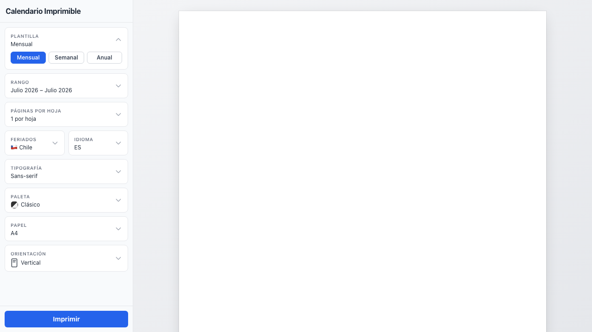

# Printable Calendar

A customizable printable calendar generator with multiple themes, fonts, and layouts.



## Features

- **Templates**: Monthly, Weekly, Yearly
- **15 Themes**: Classic, Modern, Minimal, Bold, Elegant, Compact, Playful, Retro, Sepia, Pastel, Forest, Berry, Ocean, Sunset, Black & White
- **10 Fonts**: Sans-serif, Serif, Monospace, Arial, Georgia, Times New Roman, Courier New, Verdana, Trebuchet MS, Comic Sans MS
- **Paper sizes**: A4, Letter, Legal
- **Orientations**: Portrait, Landscape
- **Pages per sheet**: 1, 2, or 4
- **Holidays**: Chile, Argentina, Mexico, United States, Brazil
- **Multi-language**: English, Spanish, French, Portuguese, German
- **PDF download** (browser print)

## Tech Stack

- React 19
- TypeScript
- Vite
- Tailwind CSS
- Canvas API (rendering)
- i18next (translations)
- react-datepicker

## Development

```bash
npm install
npm run dev
```

## Build

```bash
npm run build
npm run preview
```

## Tests

```bash
npm test
```
